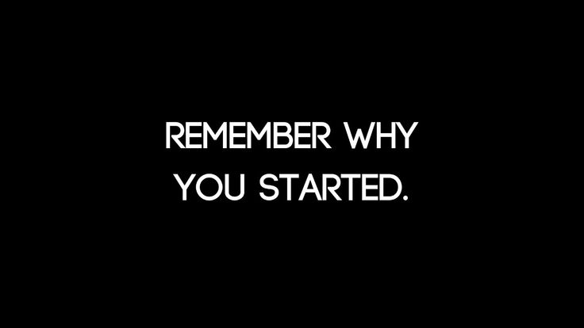

<!-- Banner -->

  

<!-- Name -->
<h1 align="center" style="
  font-family:Georgia; 
  font-weight:900; 
  letter-spacing:4px;">
  
    VAIBHAV KIRAN
  
</h1>

  Biomedical Engineering • AI in Healthcare • Device Prototyping

---

<!-- Quick Links -->

  
  
  
  

---

<!-- Typing Animation -->

  

---

## Skill Set

**Programming:** Python, MATLAB, Embedded C  
**AI/ML:** TensorFlow, Keras, Medical Analytics  
**Computer Vision:** OpenCV, Image Segmentation  
**Biomedical:** CT/MRI Processing, Sensors, Signal Data  
**Hardware:** Arduino, IMUs, PCB basics  
**Design:** Fusion 360, SolidWorks

---

## GitHub Activity

  

---

